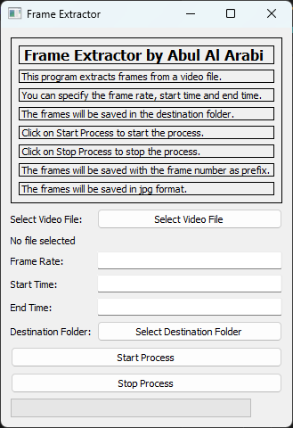

# Video Frame Extractor



## Description
This program is designed to extract frames from a video file. It provides a user-friendly interface for specifying parameters such as frame rate, start time, and end time. The extracted frames are saved in a destination folder with each frame labeled with its frame number as a prefix. Frames are saved in the JPG format.

## How to Use
1. **Specify Parameters**: Enter the desired frame rate, start time, and end time.
2. **Start Process**: Click on the "Start Process" button to begin the frame extraction process.
3. **Stop Process**: Click on the "Stop Process" button to halt the extraction process.

## Requirements
- Python 3.x
- PyQt5 (Python library for creating graphical user interfaces)

## Installation
* Download the release
* Or Clone the repository:
```bash
git clone https://github.com/your_username/video-frame-extractor.git
```

## Usage
* Run the executable
* Or Run the program using Python:
```bash
python extractor.py
```


## Contributing
Contributions are welcome! If you find any bugs or have suggestions for improvements, please open an issue or create a pull request.

